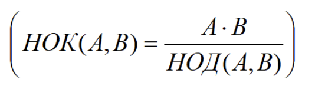

># Solve the tasks:

1. Write a method(s) for finding the greatest common divisor and the smallest common multiple of two natural numbers:
   

2. Write a method(s) for finding the greatest common divisor of four natural numbers.

3. Write a method(s) for finding the smallest common multiple of three natural numbers.

4. Write a method(s) for calculating the sum of factorials of all odd numbers from 1 to 9.

5. Create a program that finds the second-largest number in the array A[N] (print out the number that is smaller than the maximum element of the array, but larger than all other elements).

> Task Solving Memo:

1. Read the task condition several times.
2. Create an algorithm for solving a problem with several data sets (for example, integers and real numbers, sets with negative numbers, etc.).
3. Pay attention to the maximum allowable values.
4. Try to simplify the algorithm (if possible and understand how to do it)Simplify the algorithm (you can use pseudocode).
5. Write code in Java. Use comments.
6. Test the code using several input data sets in accordance with paragraph 2 and make sure that the written code is working properly.
7. The task is considered solved if the year was completed successfully in accordance with the condition and the output parameters correspond to the input parameters.
8. Place the solved task in an open Git repository.